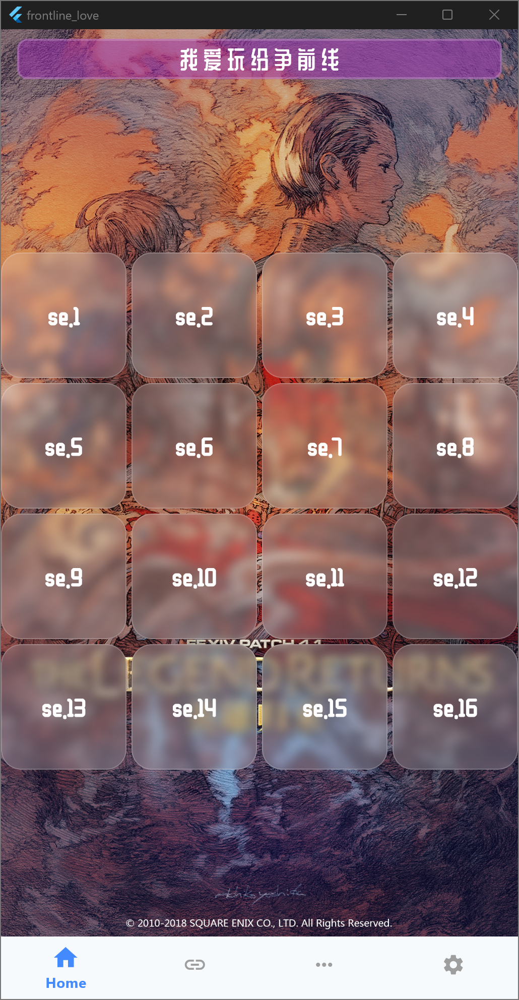

# Frontline Love

我要玩纷争前线!!

## 技术

本项目使用 Flutter 构建，以支持全平台。

## 软件功能

* 手动点击按钮播放特定宏声音 (<se.1> ~ <se.16>)
* 支持粘贴宏并解析，模拟宏声音运行 (目前未完成)

## 软件下载

[Github Release](https://github.com/qingzhixing/frontline_love/releases/latest)

## 软件效果

## Todo List

* [ ] 支持宏解析
* [ ] 支持横屏以及宽屏设备使用
